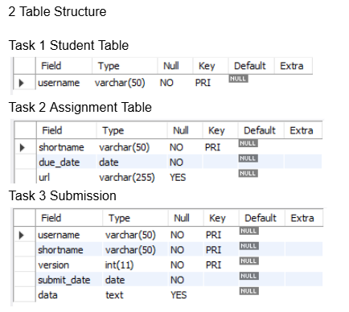

# 📘 Finals Lab Task 2: Student Assignment Submission Database

---

## ✅ Student Table

- This table stores information about each student.
- Each student has:
  - A `username` (up to 50 characters) which acts as their unique ID.
- This will be used to link the student to their submissions.

---

## ✅ Assignment Table

- This table stores all the assignments created by a teacher or system.
- Each assignment includes:
  - A `shortname` (up to 50 characters) to uniquely identify the assignment.
  - A `due_date` which is required (cannot be null).
  - A `url` which may contain a link to the assignment instructions or materials (can be null).

---

## ✅ Submission Table

- This table tracks all the assignment submissions from students.
- Each submission includes:
  - A `username` — the student who submitted it.
  - A `shortname` — the assignment it's for.
  - A `version` — used to track resubmissions or edits.
  - A `submit_date` — when it was submitted (required).
  - `data` — the actual submission content (text format).
- The combination of `username`, `shortname`, and `version` helps uniquely identify each specific submission attempt.

---

## 🔗 Relationships and Constraints

- The `submission` table has **foreign keys** referencing both:
  - `username` in the `student` table.
  - `shortname` in the `assignment` table.
- These foreign key relationships enforce **referential integrity**, meaning:
  - You can't submit an assignment as a student who doesn't exist.
  - You can't submit work for an assignment that hasn’t been created.
- This structure keeps the data accurate and prevents orphaned records.

---

## Task Outputs

---
## Here's the Query Statements [Finals Lab Task 1](Query%20Statements)

---
## Here's the Table Structure (See screenshot)

---
## Here's the ER Diagram (See screenshot)

---
## Here's the Final file output [Finals Lab Task 1](Finals%20Lab%20Task%202.sql)
