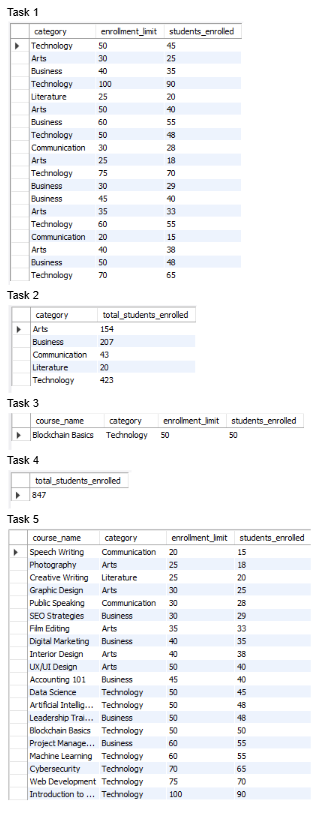

# 📘 Finals Lab Task 3-1: Using SELECT Clause

---

1. **Create a new database** named `online_courseDB`.
2. **Use the database** with the `USE` statement.
3. **Import the existing table and data** by downloading and executing the `online Course.sql` file (20 pre-filled course records included).

---

### 📊 Table: `courses`

The `courses` table is already created with the following fields:

- `id`: Unique integer, auto-incremented, and primary key.
- `course_name`: VARCHAR, not null.
- `category`: VARCHAR, not null.
- `enrollment_limit`: Integer, not null.
- `students_enrolled`: Integer, not null.

---

## ✅ Tasks to Perform

### 🔹 Task 1
- Retrieve all courses where the number of `students_enrolled` is **less than** the `enrollment_limit`.

### 🔹 Task 2
- Group courses by `category` and calculate the **total number of students enrolled** in each category.

### 🔹 Task 3
- Retrieve courses that are **fully enrolled** (i.e., `students_enrolled` equals `enrollment_limit`).

### 🔹 Task 4
- Calculate the **total number of students enrolled** across all courses.

### 🔹 Task 5
- Sort all courses by `students_enrolled` in **ascending order**.

---

## 🔗 Task Outputs

---

### 📄 Here's the Query Statements [Finals Lab Task 3-1](QS3-1)

---

### 📊 Here's the Output Query (See screenshot)

---

### 💾 Here's the Final SQL File [Finals Lab Task 3-1](Finals%20Lab%20Task%203-1.sql)

