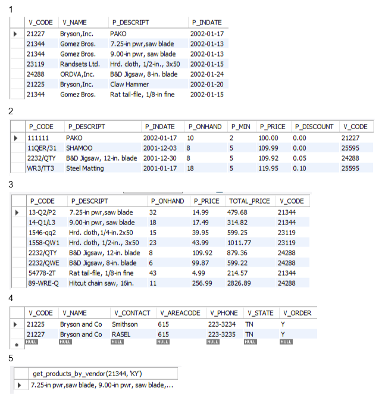

# 📘 Finals Task 5: Views, Stored Procedure & Functions

---

## ✅ Task 1: View – Products From 2002 Onwards

- For this task, we need to create a **view** that shows vendor and product details.
- Specifically, we're looking for all products where the `p_indate` (product added date) is from **2002 or later**.
- The view should include:
  - `vendor_code`
  - `vendor_name`
  - `product_description`
  - `p_indate`

---

## ✅ Task 2: View – Products in Price Range 100–150

- Here, we create another **view** to focus on products that fall within a certain price range.
- Only include products where the price is **between 100 and 150**.
- This is useful when analyzing mid-range items or creating a filtered product catalog.

---

## ✅ Task 3: View – Total Product Value for Selected Vendors

- This view is about **calculating the total value** of products on hand.
- Use the formula: `p_onhand * p_price` to compute a column called `TOTAL_PRICE`.
- But! Only include products from vendors with the following codes:
  - `21344`, `23119`, `24288`

---

## ✅ Task 4: Stored Procedure – Update Vendor Name

- Now we're moving on to **Stored Procedures**.
- We create a procedure that takes in **one parameter** and updates a vendor’s name.
- The goal is to change `'Bryson, Inc.'` to `'Bryson and Co'`.

---

## ✅ Task 5: Function – Filter Products by Vendor Code and State

- For this one, we create a **function** that accepts **two inputs**:
  - `v_code` (Vendor Code)
  - `v_state` (Vendor State)
- The function will return the `product_description` and `price` for all products that match **both** of those inputs.

## 🔗 Task Outputs

---

### 📄 Here's the Query Statements [Finals Lab Task 5](QS5)

---

### 🗂️ Here's the Table Structure (See screenshot)

---

### 💾 Here's the Final SQL File [Finals Lab Task 5](Finals%20Lab%20Task%205.sql)
