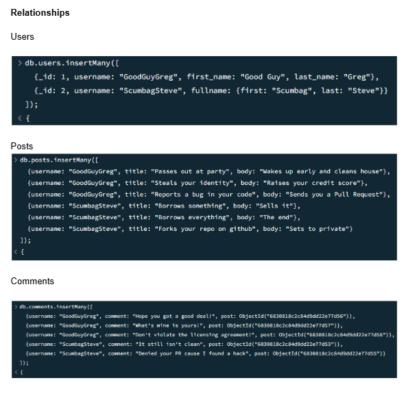
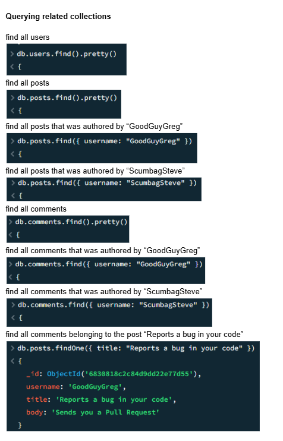

# 🗃️ Finals Lab Task 6. MongoDB Practice

---

### 📁 Create Database

- Create a new database using `use mongo_practice`

---

### 📥 Insert Documents

- Insert multiple movie documents into a `movies` collection

---

### 🔎 Query / Find Documents

- Get all documents  
- Get all documents with `writer` set to “Quentin Tarantino”  
- Get all documents where actors include "Brad Pitt"  
- Get all documents with `franchise` set to "The Hobbit"  
- Get all movies released in the 90s  
- Get all movies released before the year 2000 or after 2010  

---

### ✏️ Update Documents

- Add synopsis to *The Hobbit: An Unexpected Journey*  
- Add synopsis to *The Hobbit: The Desolation of Smaug*  
- Add actor "Samuel L. Jackson" to *Pulp Fiction*  

---

### 🧠 Text Search

- Find all movies with "Bilbo" in synopsis  
- Find all movies with "Gandalf" in synopsis  
- Find movies with "Bilbo" and not "Gandalf" in synopsis  
- Find movies with "dwarves" or "hobbit" in synopsis  
- Find movies with both "gold" and "dragon" in synopsis  

---

### 🗑️ Delete Documents

- Delete the movie *Pee Wee Herman’s Big Adventure*  
- Delete the movie *Avatar*  

---

### 👥 Relationships

#### Users  
- Insert user documents

#### Posts  
- Insert posts with references to users

#### Comments  
- Insert comments with references to users and posts

---

### 🔍 Querying Related Collections

- Find all users  
- Find all posts  
- Find all posts authored by “GoodGuyGreg”  
- Find all posts authored by “ScumbagSteve”  
- Find all comments  
- Find all comments authored by “GoodGuyGreg”  
- Find all comments authored by “ScumbagSteve”  
- Find all comments belonging to the post *“Reports a bug in your code”*

---
