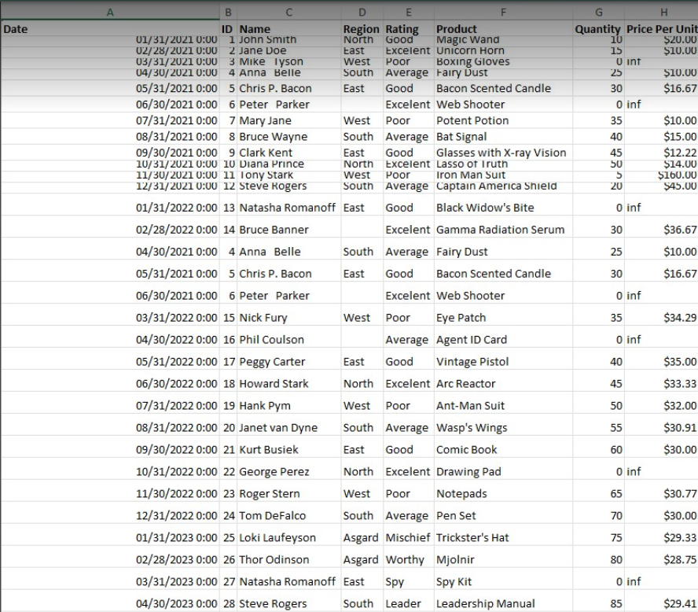
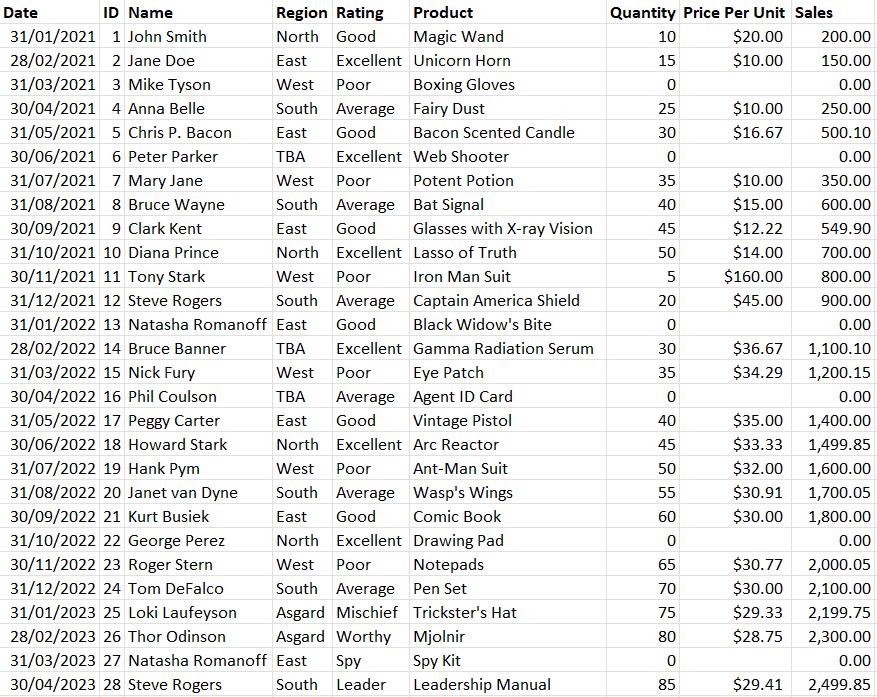
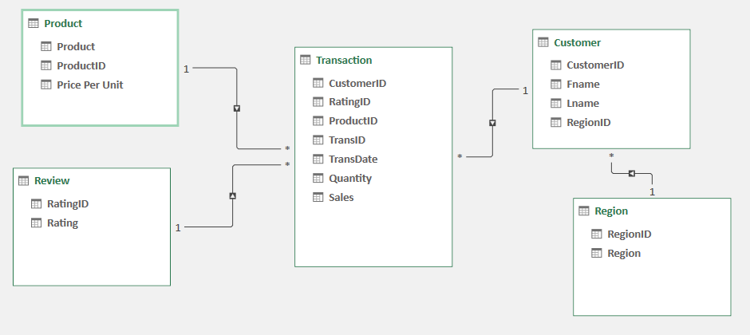

# Midterm Lab Task 1 - Data Cleaning and Preparation using Excel

## Task Overview

### 1. Autofit Columns and Rows
Ensure all data is visible:
- **Manual**: Select the whole worksheet and double-click between any two column labels.
- **Keyboard Shortcuts**: `CTRL+A` to select all data, then `ALT,H,O,I` for columns and `ALT,H,O,A` for rows.

### 2. Identify and Remove Duplicates
Highlight and remove duplicates:
- **Highlight**: Home > Conditional Formatting > Duplicate values.
- **Remove**: Data > Remove Duplicates.

### 3. Trim Extra Spaces
Remove unwanted spaces:
- Use the formula `=TRIM(C3)` in an empty column, then copy and paste as values.

### 4. Eliminate Blank Cells
Fill blank cells quickly:
- Find & Select > Go To Special > Blanks, then fill with a placeholder or copy adjacent values.

### 5. Spell Check
Correct spelling errors:
- Select columns > Review > Spelling (or `F7`).

### 6. Data Validation
Prevent errors with validation:
- Data > Data Validation > List, and enter valid options.

### 7. Handle Errors with IFERROR
Manage errors in formulas:
- Use `=IFERROR([@Quantity]*[@[Price Per Unit]], "Missing")` to replace errors with a custom message.

### 8. Number Formats
Keep numbers clean:
- Use `General` or `Number` format, not `Currency` or `Accounting`.

### 9. Find & Replace
Quickly replace values:
- Home > Find & Select > Replace (or `CTRL+H`).
## Normalization
- Performed `1NF`
- Perform Table split using `2NF`
- Perform `3NF`
- Mapped the Normalized tables as a Physical Data Model

## Here's the screenshot of my output before I started data cleaning (See screenshot)

## Here's the screenshot of my output after I started data cleaning (See screenshot)
.
## Here's the Physical Data Model
.

## Here's the final output [Midterm Lab Task 1](Midterm%20Task%201.xlsx)
